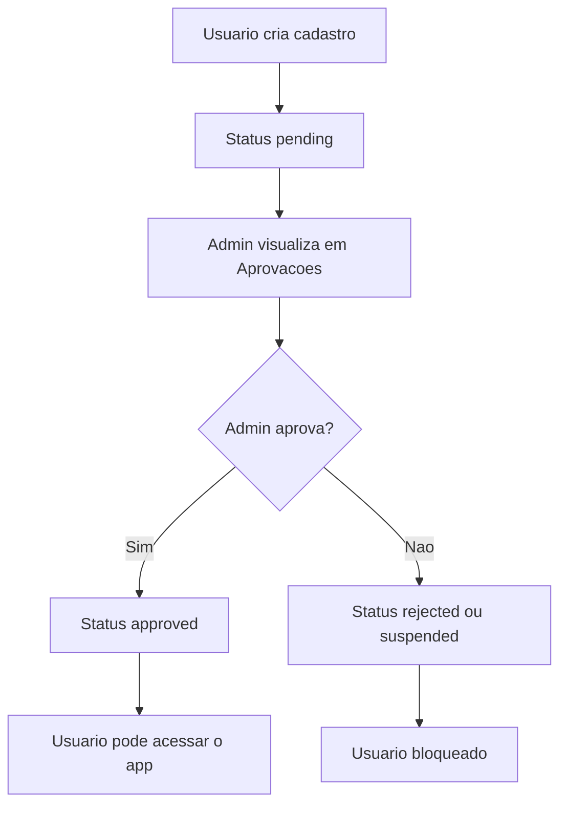
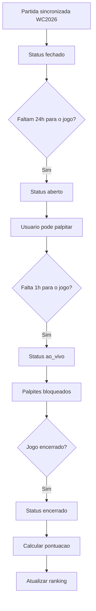
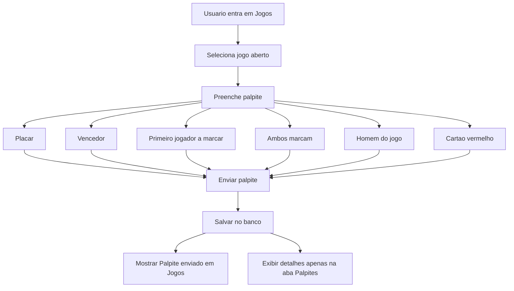
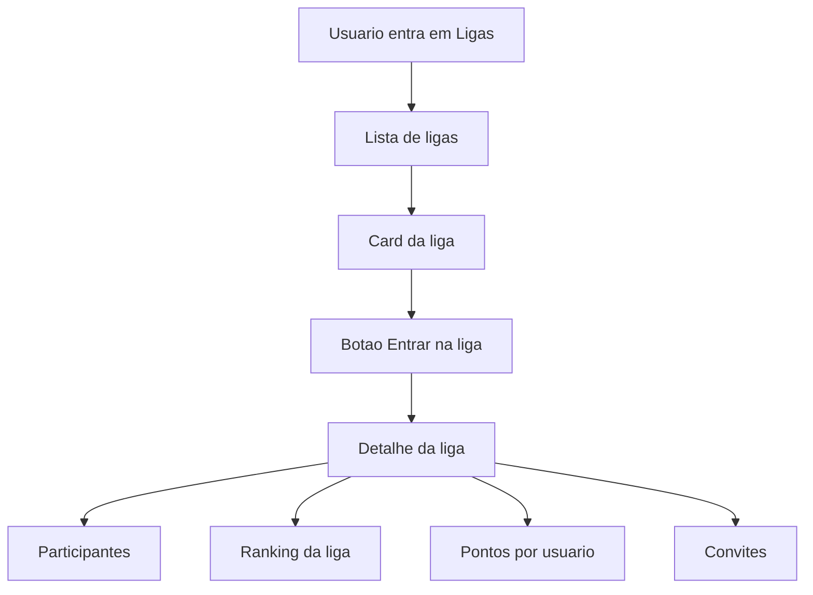

# Gol de Ouro - Fluxo Oficial do Produto

Atualizado em 2026-06-05.

## Objetivo

Este documento consolida o fluxo funcional oficial do Gol de Ouro sem misturar Admin com Usuario e sem alterar regras fora do escopo validado.

## Fluxo 1 - Cadastro e aprovacao

Regras implementadas:

- Todo cadastro novo nasce como `pending`.
- Apenas usuario `approved` e nao bloqueado pode acessar fluxos autenticados completos.
- Usuarios `pending`, `rejected` ou `suspended` nao conseguem palpitar.
- O bloqueio tambem existe no banco via `ensure_prediction_submission()`, nao apenas na UI.

## Fluxo 2 - Ciclo da partida

Regras implementadas:

- `prediction_open_at` abre 24h antes.
- `prediction_close_at` fecha 1h antes.
- `ao_vivo` e `encerrado` bloqueiam novo palpite e edicao.
- `encerrado` dispara recalculo idempotente de pontos.

## Fluxo 3 - Palpite

Regras implementadas:

- Jogos mostra estado resumido: `Palpite enviado`.
- Detalhes completos ficam somente na aba Palpites.
- Mobile tambem nao mostra placar do palpite na tela de detalhes da partida.

## Fluxo 4 - Ligas

Cada liga funciona como mini campeonato, com participantes, ranking e pontuacao agregada dos usuarios envolvidos.

## Validacao

Validado por `npm run qa:user-flow`, cobrindo cadastro, aprovacao, login, palpite, persistencia, bloqueio, encerramento, pontuacao, ranking, conquistas, notificacoes e liga.
