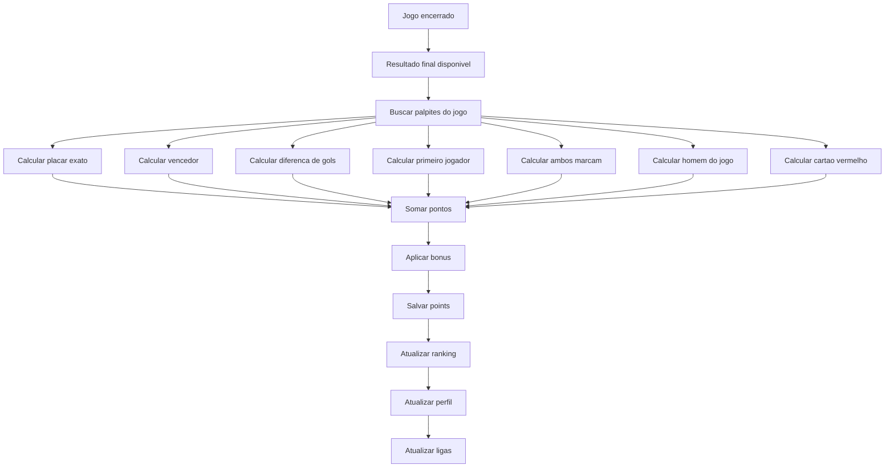

# Gol de Ouro - Fluxo de Pontuacao

Atualizado em 2026-06-05.

## Regra oficial

A pontuacao e aditiva. Cada criterio correto soma pontos ao palpite.

| Criterio | Pontos |
| --- | ---: |
| Placar exato | 10 |
| Vencedor correto | 5 |
| Empate correto | 5 |
| Diferenca de gols | 3 |
| Primeiro jogador a marcar | 8 |
| Ambos marcam | 2 |
| Homem do jogo | 6 |
| Cartao vermelho | 2 |
| Combo Ouro: placar exato + primeiro jogador | +10 |
| Combo Perfeito: acertou tudo | +20 |

## Fluxo

## Implementacao

- Banco: `public.recalculate_match_points(target_match_id)`.
- Shared web/mobile: `calculatePredictionPoints()`.
- Job local: `scripts/jobs-matches.cjs`.
- Validacao isolada: `npm run validate:match-rules`.

## Exemplo validado

Resultado oficial: Mexico 2 x 1 South Africa.

Palpite perfeito:

- placar 2 x 1;
- vencedor Mexico;
- primeiro gol Hirving Lozano;
- ambos marcam: sim;
- homem do jogo Edson Alvarez;
- cartao vermelho: sim.

Pontuacao validada: 66 pontos.
